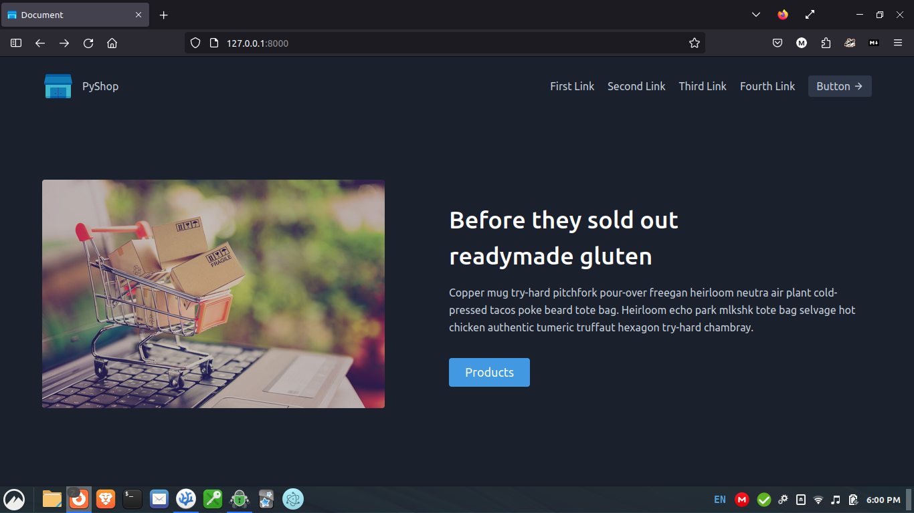
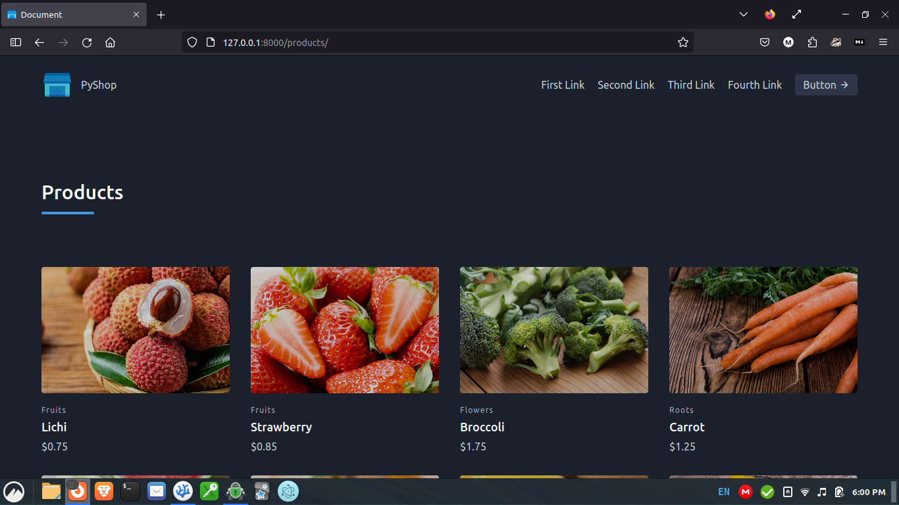
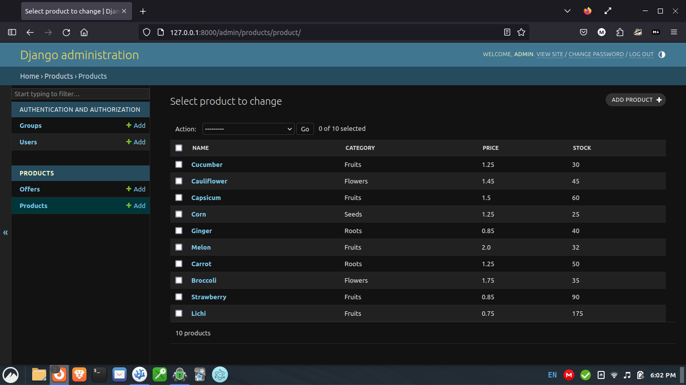
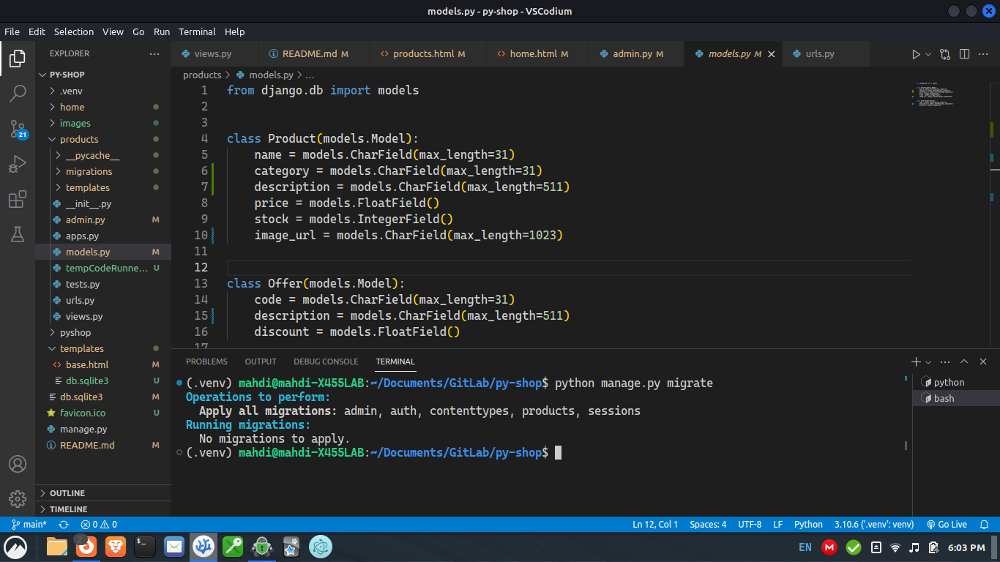

# Py Shop

My first Django project.

## How to see the website in your computer

Clone the repository

```bash
git clone https://gitlab.com/mahdihasan2005/py-shop.git
```
Go inside the directory

```bash
cd py-shop
```
Enable python virtual environment

```bash
source .venv/bin/activate
```
Run the development server

```bash
python manage.py runserver
```

And open the link in your browser. That's all.

## Some screenshots










